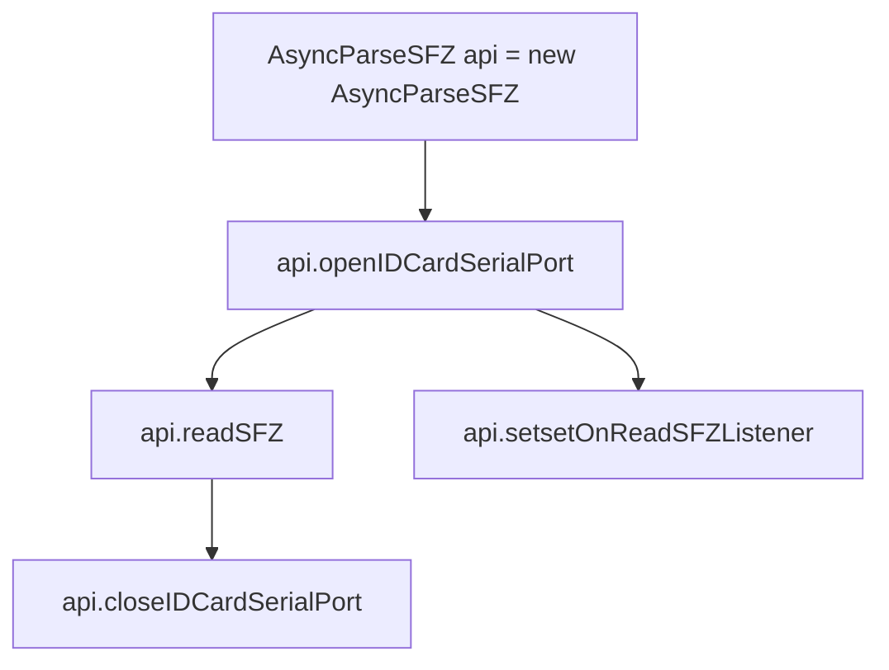

## Android 入门

```mermaid

graph TB
  A[AsyncParseSFZ api = new AsyncParseSFZ]-->B[api.openIDCardSerialPort]
  B-->C[api.readSFZ]
  C-->D[api.closeIDCardSerialPort]
  
  B-->E[api.setsetOnReadSFZListener]


```
